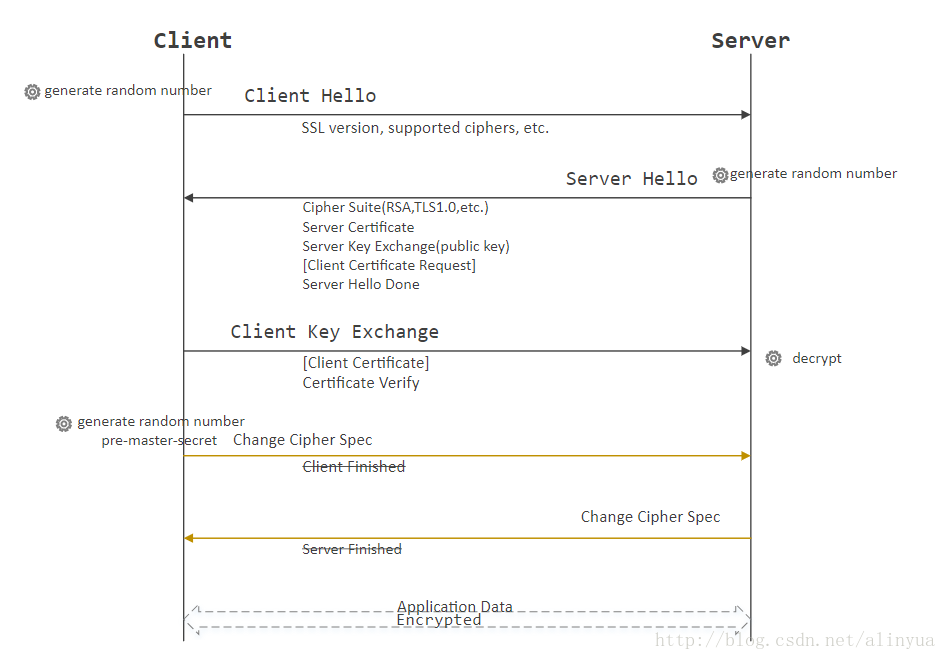

## Homework1
### SSDP(简单服务发现协议)
- 一种应用层协议，是实现即插即用的核心协议之一。
- 在网络中，接收服务的客户端可以通过SSDP协议查询自己所在网络中提供服务的设备(服务器)，而设备（服务器）也可以通过SSDP协议告知网络中的客户端自己的存在。
- 
>设备查询消息格式 
>M-SEARCH * HTTP/1.1 
>HOST: 239.255.255.250:1900 
>MAN: "ssdp:discover" 
>MX: 5 
>ST: ssdp:all 
-  HOST 是SSDP默认的广播ip与端口，MAN 默认值为"ssdp:discover",ST:设备的状态。
设备回应查询的格式 
>HTTP/1.1 200 OK 
>CACHE-CONTROL: max-age = seconds until advertisement expires 
>DATE: when reponse was generated  
>EXT: 
>LOCATION: URL for UPnP description for root device 
>SERVER: OS/Version UPNP/1.0 product/version 
>ST: search target 
>USN: advertisement UUID 

### TCP(传输控制协议)
- 在不可靠的互联网络上提供可靠的端到端字节流而专门设计的一个传输协议。
- TCP为了保证报文传输的可靠，就给每个包一个序号，同时序号也保证了传送到接收端实体的包的按序接收。然后接收端实体对已成功收到的字节发回一个相应的确认（ACK）；如果发送端实体在合理的往返时延（RTT）内未收到确认，那么对应的数据（假设丢失了）将会被重传。
- 建立连接，原理图如下图 

- 三次握手建立连接的过程：
>- 建立连接时,客户端发送syn包到服务器,并进入SYN_SEND状态,等待服务器确认 
>- 服务器收到syn包,必须确认客户的SYN,同时自己也发送一个SYN包（syn=k）,即SYN+ACK包,此时服务器进入SYN_RECV状态 
>- 客户端收到服务器的SYN＋ACK包,向服务器发送确认包ACK(ack=k+1),此包发送完毕,客户端和服务器进入ESTABLISHED状态,完成三次握手 
- SYN：表示同步序列编号(Synchronize Sequence Numbers)是否有效。该标志仅在三次握手建立TCP连接时有效
- ACK:在通信中表示发来的数据是否确认接收无误
- SYN_RECV：服务端被动打开后,接收到了客户端的SYN并且发送了ACK时的状态
- 取消连接，如下图 

- 取消连接相关过程
>- 某个应用进程首先调用close，称该端执行“主动关闭”（active close）。该端的TCP于是发送一个FIN分节，表示数据发送完毕.
>- 接收到这个FIN的对端执行 “被动关闭”（passive close），这个FIN由TCP确认
>- 一段时间后，接收到这个文件结束符的应用进程将调用close关闭它的套接字。这导致它的TCP也发送一个FIN
>- 接收这个最终FIN的原发送端TCP（即执行主动关闭的那一端）确认这个FIN. 

### TLS(安全传输层协议)
- 用于在两个通信应用程序之间提供保密性和数据完整性
- 该协议由两层组成： TLS 记录协议（TLS Record）和 TLS 握手协议（TLS Handshake）
- 原理图 

- Client Hello(客户端发出请求):在TLS握手阶段，客户端首先要告知服务端，自己支持哪些加密算法（版本号TLSv1.2），所以客户端需要将本地支持的加密套件(Cipher Suite)的列表传送给服务端。除此之外，客户端还要产生一个随机数，这个随机数一方面需要在客户端保存，另一方面需要传送给服务端，客户端的随机数需要跟服务端产生的随机数结合起来产生Master Secret
- Serve Hello(服务器响应)：
- >服务端需要将自己的证书发送给客户端。
- >在服务端向客户端发送的证书中没有提供足够的信息（证书公钥）的时候，还可以向客户端发送一个 Server Key Exchange。
- >对于非常重要的保密数据，服务端还需要对客户端进行验证，以保证数据传送给了安全的合法的客户端。
- >服务端可以向客户端发出 Cerficate Request 消息，要求客户端发送证书对客户端的合法性进行验证。
- >最后服务端会发送一个Server Hello Done消息给客户端，表示Server Hello消息结束了。
- 客户端回应（Certificate Verify）
- >Client Key Exchange
- >如果服务端需要对客户端进行验证，在客户端收到服务端的 Server Hello 消息之后，首先需要向服务端发送客户端的证书，让服务端来验证客户端的合法性。
- >Certificate Verify 
- >客户端需要对服务端的证书进行检查，如果证书不是可信机构颁布、或者证书中的域名与实际域名不一致、或者证书已经过期，就会向访问者显示一个警告，由其选择是否还要继续通信。如果证书没有问题，客户端就会从服务器证书中取出服务器的公钥。然后，向服务端发送相关信息
- >ChangeCipherSpec 
- >ChangeCipherSpec是一个独立的协议，体现在数据包中就是一个字节的数据，用于告知服务端，客户端已经切换到之前协商好的加密套件（Cipher Suite）的状态，准备使用之前协商好的加密套件加密数据并传输了
- > 服务器的最后回应（Server Finish）
- > 服务端在接收到客户端传过来的 PreMaster 加密数据之后，使用私钥对这段加密数据进行解密，并对数据进行验证，也会使用跟客户端同样的方式生成 Session Secret，一切准备好之后，会给客户端发送一个 ChangeCipherSpec，告知客户端已经切换到协商过的加密套件状态，准备使用加密套件和 Session Secret加密数据了。之后，服务端也会使用 Session Secret 加密一段 Finish 消息发送给客户端，以验证之前通过握手建立起来的加解密通道是否成功。根据之前的握手信息，如果客户端和服务端都能对Finish信息进行正常加解密且消息正确的被验证，则说明握手通道已经建立成功，接下来，双方可以使用上面产生的Session Secret对数据进行加密传输了。 
### 参考文献
- [TLS原理](https://blog.csdn.net/alinyua/article/details/79476365)
- [SSDP协议](https://blog.csdn.net/zhu530548851/article/details/28611657)
- [TCP协议](https://blog.csdn.net/sinat_36629696/article/details/80740678)
